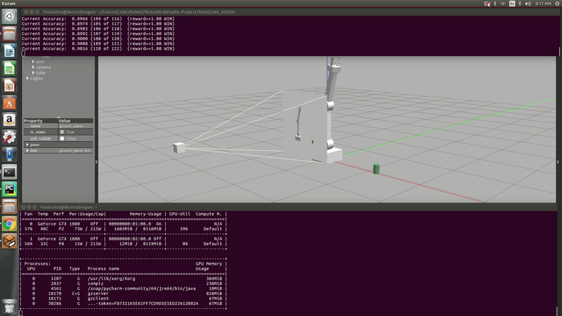

# Robotics Projects
1. [Deep Learning Drone Simulator \(Deep learning and Simulation\)](#Deep)
2. [Search And Sample Rover \(Computer Vision and Simulation\)](#Rover)
3. [Robotic Perception \(Computer Vision and Simulation\)](#Perception)
4. [Robotic Arm Pick and Drop \(ROS and Simulation\)](#Arm)
5. [Self-Driving Car Behavioral Cloning \(Deep learning and Simulation\)](#Cloning)
6. [Map a world with Slam and a Custom Robot \(ROS and Simulation\)](#Slam)
7. [BlueBot \(Android and Arduino\)](#BlueBot)
8. [Vehicle Detection\(Machine Learning \)](#VehicleDetection)
9. [Advanced Lane Finding \(Computer Vision\)](#ADL)
10. [Deep Reinforcement Learn Arm Manipulation\(Deep Reinforcement Learning\)](#DRLARM)

# Android and iOS

# Robotics
## Deep Learning Drone Simulator(Deep learning and Simulation) 
This project is about training a deep neural network to identify and track a target in simulation so-called “follow me”.
Applications like this are key to many fields of robotics and the very same techniques you apply here can be extended
to scenarios like advanced cruise control in autonomous vehicles or human-robot collaboration in industry.

#### *Github*: [Deep Learning Drone Simulator](https://github.com/fouliex/DeepLearningDroneSimulator)
 
 
## Search And Sample Rover(Computer Vision and Simulation) 
The goal of this project is to perform autonomous navigation and mapping. 
With each new image we receive from the rover's camera, we can make decision about sending commands like throttle,
brake and steering the rover therefore it becomes autonomous.

### *Github*: [Search And Sample Rover](https://github.com/fouliex/SearchAndSampleRoverProject)

 
## Robotic Perception(Computer Vision and Simulation) 
This project is modeled after Amazon Robotics Challenge. Giving a robot the ability to locate an object in a cluttered
environment, pick it up and then move it to some other location is not just an interesting problem to try to solve,
it's a challenge at the forefront of the robotics industry today.

### *Github*: [Robotic Perception](https://github.com/fouliex/RoboticPerception)

 

## Robotic Arm Pick and Drop(ROS and Simulation) 
This project is to control a Robotic Arm with six degrees of freedom to perform pick and drop action using
Forward and Inverse Kinematics.

### *Github*: [Robotic Arm Pick and Drop](https://github.com/fouliex/RoboticArmPickAndDrop)

  
## Self-Driving Car Behavioral Cloning(Deep Learning and Simulation) 
This project is to learn more about Deep Neural Networks and Convolutional Neural Networks by cloning driving behavior.
A model is trained, validated and tested using Keras framework.

### *Github*: [Self-Driving Car Behavioral Cloning](https://github.com/fouliex/SelfDrivingCarBehavioralCloning)

 
## Map a world with Slam and a Custom Robot(ROS and Simulation) 
This project is about implementing SLAM(Simultaneous Localization and mapping) with RTAB-MAP(Real-Time Appearance-Base Mapping).
Two 2D occupancy grid and a 3D octomap is created from a simulated environment and then map with a custom robot FouliexBot.

### *Github*: [Map a World with Slam and a Custom Robot](https://github.com/fouliex/MapAWorldWithSlamAndACustomRobot)
 
## BlueBot (Android and Arduino) 
Bluetooth Remote Controlled Robot with Arduino and Android.

 
### *Github*: [BlueBot](https://github.com/fouliex/BlueBot)

## Vehicle Detection (Machine Learning) 
This project is to write a software pipeline that detect vehicles in a video 

 
### *Github*: [VehicleDetection](https://github.com/georgeerol/VehicleDetection)

## Advanced Lane Finding (Computer Vision) 
This project is to write a software pipeline that detect vehicles in a video 

 
### *Github*: [Advanced Lane Finding](https://github.com/georgeerol/AdvancedLaneFinding)

## Deep Reinforcement Learn Arm Manipulation (Deep Reinforcement Learning) 
This project is based on the Nvidia open source project "jetson-reinforcement" developed by Dustin Franklin. The goal of the project is to create a DQN agent and define reward functions to teach a robotic arm to carry out two primary objectives:
1. Have any part of the robot arm touch the object of interest, with at least a 90% accuracy.
2. Have only the gripper base of the robot arm touch the object, with at least a 80% accuracy. 

 
### *Github*: [Deep Reinforcement Learn Arm Manipulation](https://github.com/georgeerol/DeepRLArmManipulation)

