<!-- Navigation -->

  <nav class="nav-menu">
    <a href="#about">About</a>
    <a href="#client-work">Client Work</a>
    <a href="#robotics">Robotics</a>
    <a href="#data-pipeline">Data Pipeline</a>
    <a href="#fullstack">Full Stack</a>
    <a href="#mobile">Mobile</a>
    <a href="#contact">Contact</a>
    
    <!-- Dark Mode Toggle -->
    

      

        ☀️
        🌙
      

    

  </nav>

<!-- Enhanced Hero Section -->

  

    

      

        
      

    

    
    

      <h1>George Erol Fouché</h1>
      
Senior Software Engineer | 10+ Years Experience

      

        
Backend Gaming AI & Data Engineering

        

          <canvas id="pongGame" width="100" height="70"></canvas>
          <canvas id="snakeGame" width="100" height="70"></canvas>
          <canvas id="pixelCharacterGame" width="100" height="70"></canvas>
        

      

      
      <!-- Call to Action Buttons -->
      

        <a href="#robotics" class="btn btn-primary">🚀 View Projects</a>
        <a href="https://github.com/georgeerol" class="btn btn-outline" target="_blank">📂 GitHub</a>
        <a href="#contact" class="btn btn-outline">📧 Contact</a>
      

    

    
    

      

        
🔍 Open to New Opportunities

        
📍 San Francisco Bay Area

      

      
      <!-- Quick Stats -->
      

        

          15+
          Projects
        

        

          5
          Tech Domains
        

        

          10+
          Years Experience
        

      

    

  

<!-- About Section -->
<section id="about" class="about-section">
  <h2>👨🏿‍💻 About Me</h2>
  
  

    

      
I'm a <strong>Senior Software Engineer with 10+ years</strong> of experience specializing in <strong>Backend Development</strong>, <strong>Data Engineering</strong>, and <strong>Robotics/AI</strong>. Most recently at Series Entertainment (Gaming AI Startup), I have a proven track record of leading teams and delivering scalable solutions across Gaming, AI, Cybersecurity, and Enterprise environments.

      
      

        <h4>🌍 My Journey</h4>
        
Born in New York and raised in Haiti, I returned to the United States at age 16 as an ESL student. Coming from Haiti to California felt like <em>making it to the NBA — but in software engineering</em>. That experience shaped my ambition, discipline, and work ethic that drives me today.

        
<strong>Trilingual:</strong> 🇺🇸 English • 🇫🇷 French • 🇭🇹 Haitian Creole

      

      
      

        <h4>🎓 Education & Certifications</h4>
        <ul>
          <li><strong>B.S. Computer Engineering</strong> - Pennsylvania State University</li>
          <li><strong>Minor:</strong> Nanotechnology</li>
          <li><strong>Certificate:</strong> International Engineering</li>
          <li><strong>Udacity Nanodegree:</strong> Robotic Software Engineer</li>
          <li><strong>Udacity Nanodegree:</strong> Full Stack Web Developer</li>
        </ul>
      

    

    

      

        <h4>🤖 Robotics & AI</h4>
        

          ROS
          Computer Vision
          Deep Learning
          TensorFlow
          OpenCV
          SLAM
        

      

      
      

        <h4>🔧 Data Engineering</h4>
        

          Apache Spark
          Kafka
          PySpark
          AWS
          Azure
          ETL Pipelines
        

      

      
      

        <h4>🌐 Backend Development</h4>
        

          Java Spring Boot
          Python Flask
          Microservices
          REST APIs
          Docker
          Kubernetes
        

      

      
      

        <h4>📱 Mobile & Frontend</h4>
        

          Android
          iOS
          React
          Vue.js
          JavaScript
        

      

    

  

</section>

<!-- CLIENT WORK SECTION - LEADING WITH REAL PRODUCTION APPS -->
<section id="client-work" class="projects-section">
  

    <h2>💼 Client Work</h2>
    
Production Applications Built for Real Businesses

  

<!-- SLIVER Pizzeria - CLIENT PROJECT -->

  <h3 class="client-project-title">🍕 SLIVER Pizzeria</h3>
  
Full-Stack Restaurant Platform • Bay Area Sourdough Crust Pizzeria

  
  

    <!-- Featured Card - Full Width with 2-column layout -->
    

      

        

          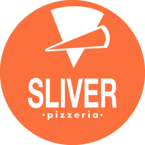
          
🏢 Client Project

        

        <h3 class="project-title">Web Platform & Operations Dashboard</h3>
        

          Next.js 14
          TypeScript
          FastAPI
          PostgreSQL
          Tailwind CSS
          Docker
          Railway
          JWT Auth
          Cloudinary
        

        
        
A modern, full-stack restaurant website built for <strong>SLIVER Pizzeria</strong> — a beloved Bay Area vegetarian pizzeria with 6 locations. Features a beautiful customer-facing site and a powerful admin dashboard for managing daily operations.

        
        

          <h4>🎯 Key Features:</h4>
          <ul>
            <li><strong>Public Website:</strong> Modern responsive homepage, 6 Bay Area locations, delivery partner integration</li>
            <li><strong>Pizza of the Day:</strong> Dynamic daily specials with image uploads and location-specific pricing</li>
            <li><strong>Admin Dashboard:</strong> JWT authentication, pizza management, location updates</li>
            <li><strong>Infrastructure:</strong> Docker containerization, Railway deployment, CI/CD pipeline</li>
          </ul>
        

        
        

          <a href="https://sliverpizzeria-web-production.up.railway.app/" class="btn btn-primary" target="_blank">🚀 Live Demo</a>
          <a href="https://www.sliverpizzeria.com/" class="btn btn-outline" target="_blank">🍕 Current Site</a>
        

      

      
      

        

          <h5>🌐 Web Experience</h5>
          <video autoplay muted loop playsinline class="demo-video">
            <source src="./images/WebDec3.mp4#t=8" type="video/mp4">
            Your browser does not support the video tag.
          </video>
        

        

          <h5>📱 Mobile Responsive</h5>
          <video autoplay muted loop playsinline class="demo-video">
            <source src="./images/MobileDec3.mp4" type="video/mp4">
            Your browser does not support the video tag.
          </video>
        

      

    

    
    <!-- Admin Dashboard Card -->
    

      <h3 class="project-title">🔐 Admin Dashboard & API</h3>
      

        FastAPI
        SQLAlchemy
        psycopg3
        Pydantic
        JWT
        REST API
      

      
      
Secure admin panel for restaurant staff to manage daily operations including Pizza of the Day updates, location management, and real-time content updates.

      
      

        <video autoplay muted loop playsinline class="demo-video project-image">
          <source src="./images/adminDec3.mp4#t=3" type="video/mp4">
          Your browser does not support the video tag.
        </video>
      

      
      

        <a href="https://sliverpizzeria-web-production.up.railway.app/admin" class="btn btn-primary" target="_blank">🔐 Admin Panel</a>
        <a href="https://sliverpizzeria-api-production.up.railway.app/docs" class="btn btn-outline" target="_blank">📚 API Docs</a>
      

    

    
    <!-- DevOps Card -->
    

      <h3 class="project-title">🚀 DevOps & Deployment</h3>
      

        Docker Compose
        Railway
        GitHub Actions
        PostgreSQL
        Cloudinary
      

      
      
Production-ready infrastructure with containerized development, automated deployments, and cloud-native architecture for scalability and reliability.

      
      

        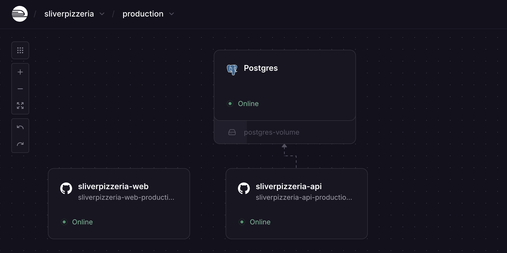
      

      
      

        <a href="https://sliverpizzeria-api-production.up.railway.app/" class="btn btn-primary" target="_blank">⚡ Backend API</a>
      

    

  

  
  <!-- SLIVER Brand Info -->
  

    
    

      <h4>About SLIVER Pizzeria</h4>
      
<em>"An experiment in culinary happiness"</em> — SLIVER offers a healthier alternative focusing on fresh produce, 100% vegetarian with sourdough crust pizza. Family owned & operated with 6 Bay Area locations serving Berkeley, Oakland, Lafayette, and Fremont.

      

        📍 Berkeley (2)
        📍 Oakland (2)
        📍 Lafayette
        📍 Fremont
      

    

  

<!-- Vintage Wine - CLIENT PROJECT -->

  <h3 class="client-project-title">🍷 Vintage Wine</h3>
  
Mobile Wine Club & E-Commerce Platform • Barnyard Wine Bar

  
  

    

      

        

          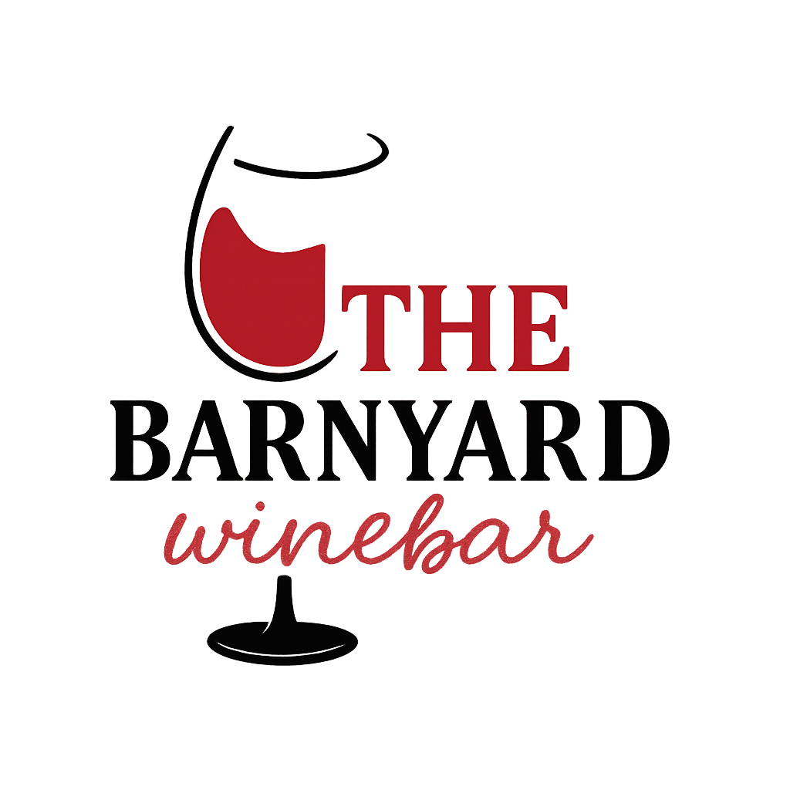
          
🏢 Client Project

        

        <h3 class="project-title">Vintage — Wine Recommendation & Club</h3>
        

          React Native (Expo)
          TypeScript
          Flask
          PostgreSQL
          Stripe
          AI Recommendations
        

        
        
A modern mobile app built for <strong>Barnyard Wine Bar</strong> — featuring wine discovery, user reviews, shopping cart, and an integrated <strong>Epic Society</strong> wine club with Stripe-powered subscriptions and AI-powered recommendations.

        
        

          <h4>🎯 Key Features:</h4>
          <ul>
            <li><strong>Wine Discovery:</strong> Detailed profiles, tasting notes, and user reviews</li>
            <li><strong>E-Commerce:</strong> Shopping cart, favorites, and order history</li>
            <li><strong>Epic Society Club:</strong> Membership tiers (Corks Crew, Curator) with preferences</li>
            <li><strong>AI Recommendations:</strong> Personalized wine suggestions based on taste profile</li>
          </ul>
        

        
        

          <a href="https://barnyardwinebar.com/" class="btn btn-primary" target="_blank">🍷 Live Website</a>
        

      

      
      

        

          <h5>🍷 Wine Discovery & Cart</h5>
          <video autoplay muted loop playsinline class="demo-video mobile-demo">
            <source src="./images/Vintage.web.mp4" type="video/mp4">
            Your browser does not support the video tag.
          </video>
        

        

          <h5>🤖 AI Recommendations</h5>
          <video autoplay muted loop playsinline class="demo-video mobile-demo">
            <source src="./images/VintageAI.web.mp4" type="video/mp4">
            Your browser does not support the video tag.
          </video>
        

      

    

    
    

      
💳

      <h3 class="project-title">Backend & Payments</h3>
      

        Flask
        SQLAlchemy
        Stripe API
        JWT Auth
      

      
      <ul class="compact-features">
        <li>✓ Stripe subscription integration</li>
        <li>✓ JWT-based authentication</li>
        <li>✓ Wine inventory management</li>
        <li>✓ Member preference tracking</li>
      </ul>
      
      

        <a href="https://barnyardwinebar.com/" class="btn btn-primary" target="_blank">🌐 Visit Site</a>
      

    

    
    

      
🍇

      <h3 class="project-title">Epic Society Wine Club</h3>
      

        Subscriptions
        Member Dashboard
        Curated Selections
      

      
      <ul class="compact-features">
        <li>✓ Corks Crew & Curator tiers</li>
        <li>✓ Mixed, Red, or White preferences</li>
        <li>✓ Shipment tracking dashboard</li>
        <li>✓ Member discounts & early access</li>
      </ul>
      
      

        <a href="https://barnyardwinebar.com/" class="btn btn-primary" target="_blank">🍷 Join Club</a>
      

    

  

  
  <!-- Vintage Brand Info -->
  

    
    

      <h4>About Barnyard Wine Bar</h4>
      
<em>"Where every glass tells a story"</em> — Barnyard Wine Bar brings curated wine experiences to wine enthusiasts through their Epic Society wine club. Members enjoy personalized selections, exclusive tastings, and a community of fellow wine lovers.

      

        🍇 Curated Wines
        📦 Monthly Shipments
        🎉 Member Events
        💳 Stripe Payments
      

    

  

</section>

<!-- Robotics Projects -->
<section id="robotics" class="projects-section">
  

    <h2>🤖 Robotics & AI Projects</h2>
  

  
  

    

      <h3 class="project-title">🚁 Deep Learning Drone Simulator</h3>
      

        Deep Learning
        Neural Networks
        Computer Vision
        Simulation
        Python
      

      
      
Train a neural network for a "follow me" feature in drones, with applications in autonomous vehicles and industrial robotics.

      
      

        <h4>🎯 Key Features:</h4>
        <ul>
          <li>Real-time object tracking and following</li>
          <li>Custom neural network architecture</li>
          <li>Simulation environment for safe testing</li>
          <li>Applicable to various autonomous systems</li>
        </ul>
      

      
      
      
      

        <a href="https://github.com/fouliex/DeepLearningDroneSimulator" class="btn btn-primary" target="_blank">🔗 View GitHub</a>
      

    

    
    

      <h3 class="project-title">🔍 Search And Sample Rover</h3>
      

        Computer Vision
        Autonomous Navigation
        Image Processing
        Path Planning
      

      
      
Autonomous rover that navigates and maps terrains using real-time camera images for guidance and sample collection.

      
      

        <h4>🎯 Key Features:</h4>
        <ul>
          <li>Real-time terrain mapping and navigation</li>
          <li>Computer vision-based object detection</li>
          <li>Autonomous sample collection</li>
          <li>Path planning and obstacle avoidance</li>
        </ul>
      

      
      
      
      

        <a href="https://github.com/fouliex/SearchAndSampleRoverProject" class="btn btn-primary" target="_blank">🔗 View GitHub</a>
      

    

    
    

      <h3 class="project-title">🦾 Robotic Perception</h3>
      

        ROS
        3D Vision
        Object Recognition
        Manipulation
        PCL
      

      
      
Tackles the challenge of object recognition and manipulation in cluttered environments, inspired by the Amazon Robotics Challenge.

      
      

        <h4>🎯 Key Features:</h4>
        <ul>
          <li>3D point cloud processing</li>
          <li>Object recognition in cluttered scenes</li>
          <li>Robotic manipulation planning</li>
          <li>Real-world application scenarios</li>
        </ul>
      

      
      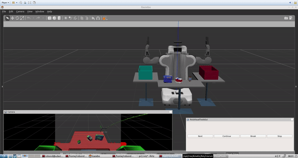
      
      

        <a href="https://github.com/fouliex/RoboticPerception" class="btn btn-primary" target="_blank">🔗 View GitHub</a>
      

    

    
    

      <h3 class="project-title">🦾 Robotic Arm Pick and Drop</h3>
      

        ROS
        Kinematics
        6-DOF
        Motion Planning
      

      
      
Control a six-degree-of-freedom robotic arm to perform precise pick and drop actions using forward and inverse kinematics.

      
      

        <h4>🎯 Key Features:</h4>
        <ul>
          <li>6-DOF robotic arm control</li>
          <li>Forward and inverse kinematics</li>
          <li>Precise manipulation tasks</li>
          <li>ROS-based control system</li>
        </ul>
      

      
      
      
      

        <a href="https://github.com/fouliex/RoboticArmPickAndDrop" class="btn btn-primary" target="_blank">🔗 View GitHub</a>
      

    

    
    

      <h3 class="project-title">🚗 Self-Driving Car Behavioral Cloning</h3>
      

        Deep Learning
        Behavioral Cloning
        Autonomous Driving
        CNN
      

      
      
Learn driving behavior using deep neural networks to simulate real-world driving conditions in a test environment.

      
      

        <h4>🎯 Key Features:</h4>
        <ul>
          <li>Behavioral cloning with deep CNNs</li>
          <li>Real-time driving simulation</li>
          <li>Data augmentation techniques</li>
          <li>End-to-end learning approach</li>
        </ul>
      

      
      
      
      

        <a href="https://github.com/fouliex/SelfDrivingCarBehavioralCloning" class="btn btn-primary" target="_blank">🔗 View GitHub</a>
      

    

    

  

</section>

<!-- Data Pipeline Projects - SECOND -->
<section id="data-pipeline" class="projects-section">
  

    <h2>🚀 Data Pipeline Projects</h2>
  

  
  

    

      <h3 class="project-title">🌐 IOT AWS SPARK</h3>
      

        Apache Spark
        AWS
        Kafka
        Docker
        IoT
        Zookeeper
      

      
      
Integrates Big Data, IoT, and cloud computing to enhance urban mobility using a 35-mile drive from San Francisco to Dublin, CA, as a case study.

      
      

        <h4>🎯 Key Features:</h4>
        <ul>
          <li>Real-time data processing for vehicle performance, GPS, weather, and traffic</li>
          <li>Scalable, fault-tolerant architecture</li>
          <li>Docker containerization for easy deployment</li>
          <li>AWS integration for storage and analytics</li>
        </ul>
      

      
      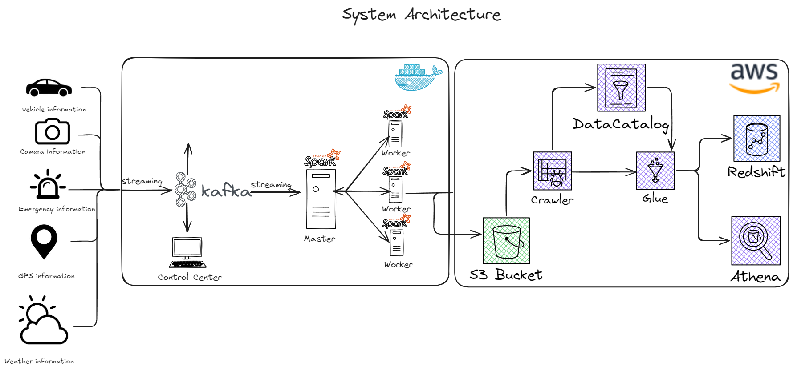
      
      

        <a href="https://github.com/georgeerol/IotAwsSpark" class="btn btn-primary" target="_blank">🔗 View GitHub</a>
      

    

    
    

      <h3 class="project-title">⚡ E2E Spark Flow</h3>
      

        Apache Spark
        Airflow
        Kafka
        Cassandra
        PostgreSQL
        Docker
      

      
      
Comprehensive data pipeline utilizing Docker, Apache Airflow, Kafka, Spark, Cassandra, and PostgreSQL to manage data throughout its entire lifecycle.

      
      

        <h4>🎯 Key Features:</h4>
        <ul>
          <li>End-to-end data processing workflow</li>
          <li>Real-time streaming with Kafka</li>
          <li>Automated scheduling with Airflow</li>
          <li>Multi-database support (Cassandra + PostgreSQL)</li>
        </ul>
      

      
      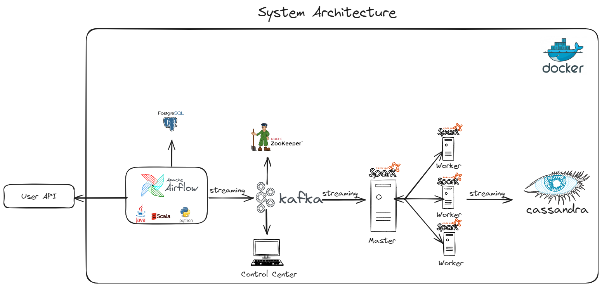
      
      

        <a href="https://github.com/georgeerol/E2ESparkFlow" class="btn btn-primary" target="_blank">🔗 View GitHub</a>
      

    

    
    

      <h3 class="project-title">💰 Commercing With Flink</h3>
      

        Apache Flink
        Real-time Analytics
        Financial Data
        Stream Processing
      

      
      
Real-time sales analytics application processing financial transactions with Apache Flink, executing complex aggregations and storing results for business analysis.

      
      

        <h4>🎯 Key Features:</h4>
        <ul>
          <li>Real-time financial transaction processing</li>
          <li>Complex event processing and aggregations</li>
          <li>Low-latency analytics for business insights</li>
          <li>Scalable stream processing architecture</li>
        </ul>
      

      
      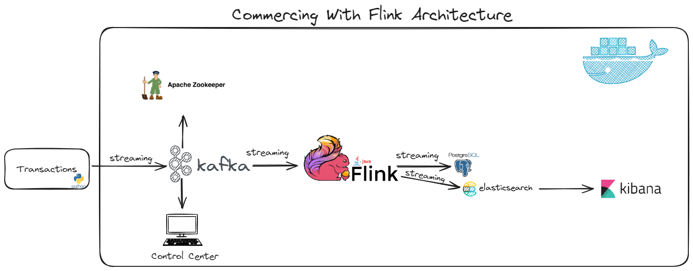
      
      

        <a href="https://github.com/georgeerol/CommercingWithFlink" class="btn btn-primary" target="_blank">🔗 View GitHub</a>
      

    

  

</section>

<!-- Full Stack Projects -->
<section id="fullstack" class="projects-section">
  

    <h2>🌐 Full Stack Web Development</h2>
  

  
  

    

      <h3 class="project-title">✅ Todo Application</h3>
      

        React
        Spring Boot
        REST API
        Full Stack
      

      
      
Comprehensive task management application with React frontend and Spring Boot backend, featuring user authentication and task organization.

      
      

        <h4>🎯 Key Features:</h4>
        <ul>
          <li>User authentication and authorization</li>
          <li>CRUD operations for task management</li>
          <li>Responsive React frontend</li>
          <li>RESTful API with Spring Boot</li>
        </ul>
      

      
      

        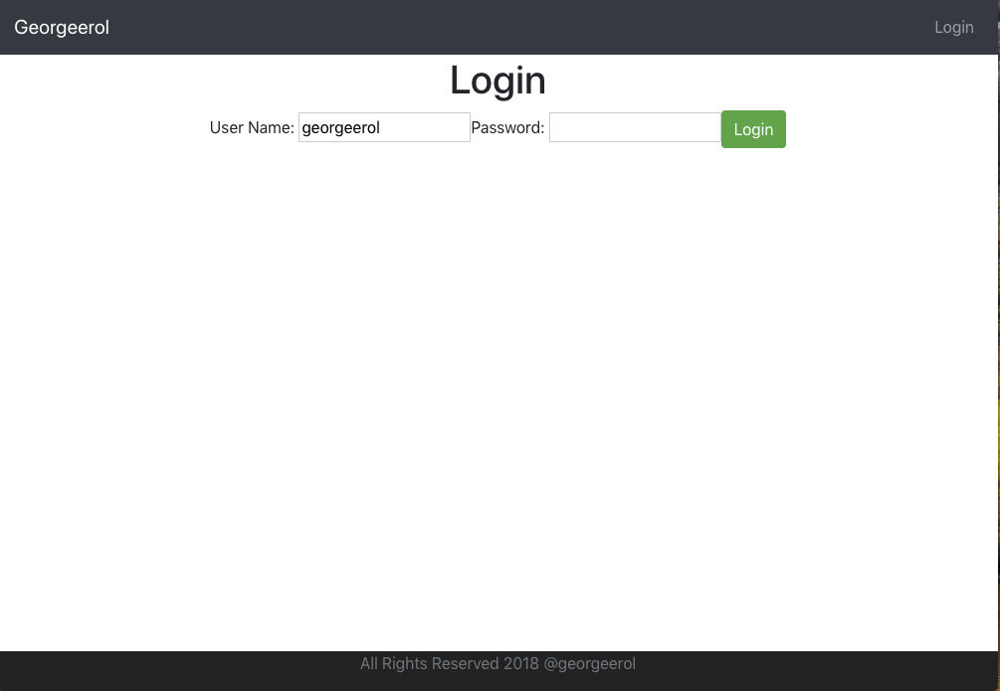
        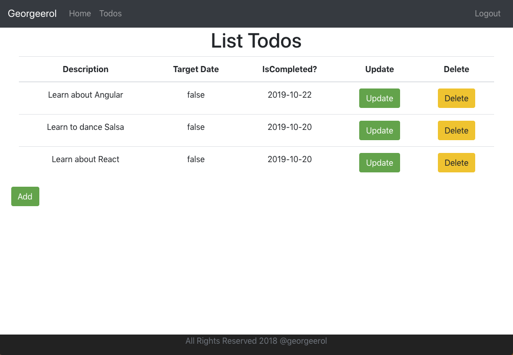
      

      
      

        <a href="https://github.com/georgeerol/ToDoApp" class="btn btn-primary" target="_blank">🔗 View GitHub</a>
      

    

    
    

      <h3 class="project-title">💰 Expense Tracker</h3>
      

        React
        Spring Boot
        Financial Management
        Data Visualization
      

      
      
Track and manage personal expenses with an intuitive web application featuring data visualization and budget management.

      
      

        <h4>🎯 Key Features:</h4>
        <ul>
          <li>Expense tracking and categorization</li>
          <li>Budget management and alerts</li>
          <li>Data visualization with charts</li>
          <li>Export and import functionality</li>
        </ul>
      

      
      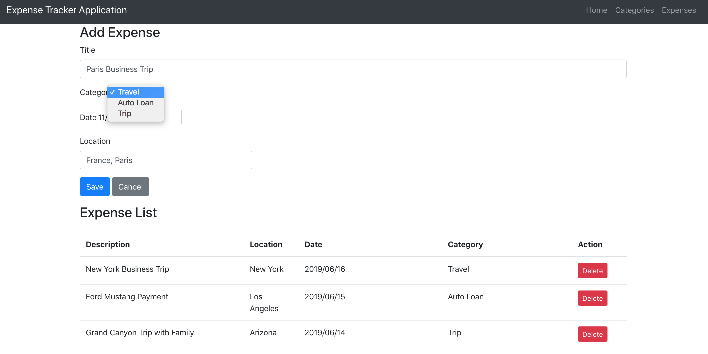
      
      

        <a href="https://github.com/georgeerol/ExpenseApp" class="btn btn-primary" target="_blank">🔗 View GitHub</a>
      

    

    
    

      <h3 class="project-title">📋 Project Management System</h3>
      

        Spring MVC
        Spring Boot
        Server-side Rendering
        Enterprise
      

      
      
Comprehensive program management tool with server-side rendering for efficient project and team management in enterprise environments.

      
      

        <h4>🎯 Key Features:</h4>
        <ul>
          <li>Project lifecycle management</li>
          <li>Team member assignment and tracking</li>
          <li>Resource allocation and planning</li>
          <li>Progress reporting and analytics</li>
        </ul>
      

      
      

        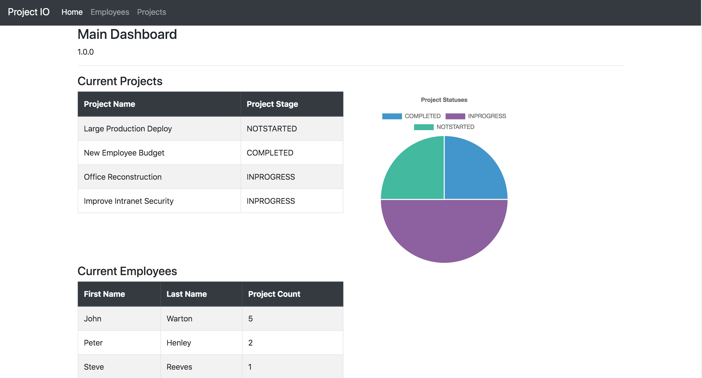
        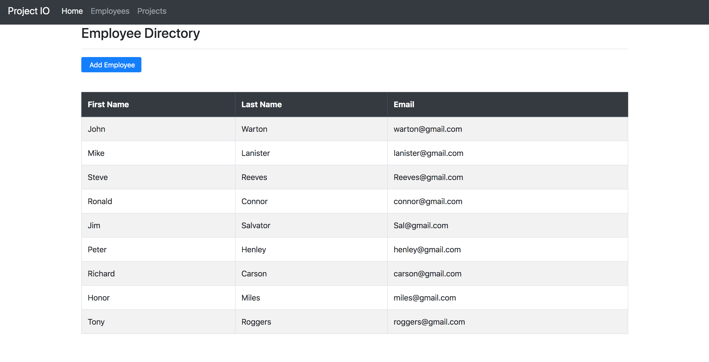
        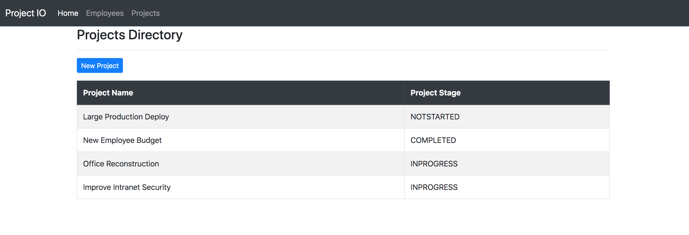
      

      
      

        <a href="https://github.com/georgeerol/ProjectManagementApp" class="btn btn-primary" target="_blank">🔗 View GitHub</a>
      

    

  

</section>

<!-- Mobile Projects - LAST -->
<section id="mobile" class="projects-section">
  

    <h2>📱 Mobile Development</h2>
  

  
  

    

      <h3 class="project-title">🌤️ Weather App</h3>
      

        Android
        iOS
        Cross-platform
        API Integration
      

      
      
Cross-platform weather application providing real-time weather updates with beautiful UI for both Android and iOS devices.

      
      

        <h4>🎯 Key Features:</h4>
        <ul>
          <li>Real-time weather data integration</li>
          <li>Location-based forecasting</li>
          <li>Beautiful, intuitive UI design</li>
          <li>Cross-platform compatibility</li>
        </ul>
      

      
      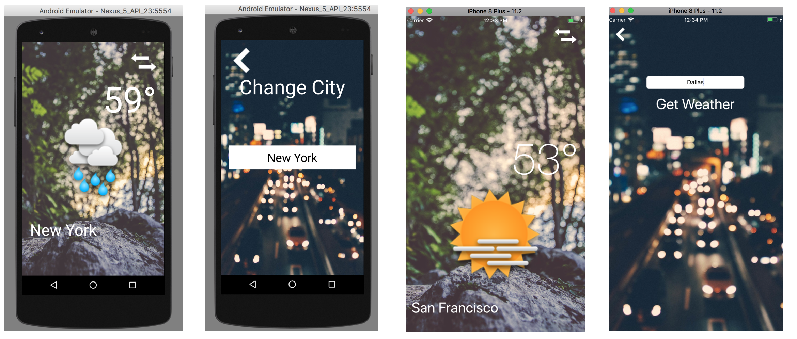
      
      

        <a href="https://github.com/georgeerol/AndroidAndIOSApps" class="btn btn-primary" target="_blank">🔗 View GitHub</a>
      

    

    
    

      <h3 class="project-title">₿ Bitcoin Ticker</h3>
      

        Android
        iOS
        Cryptocurrency
        Real-time Data
      

      
      
Monitor and display live Bitcoin exchange rates with real-time updates on both Android and iOS devices.

      
      

        <h4>🎯 Key Features:</h4>
        <ul>
          <li>Live Bitcoin price tracking</li>
          <li>Multiple exchange support</li>
          <li>Real-time market updates</li>
          <li>Clean, modern interface</li>
        </ul>
      

      
      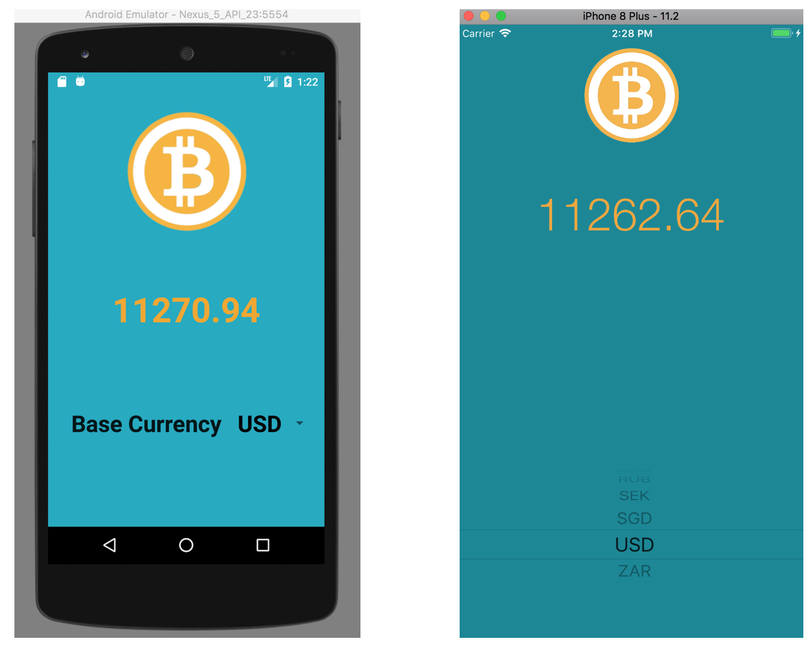
      
      

        <a href="https://github.com/georgeerol/AndroidAndIOSApps" class="btn btn-primary" target="_blank">🔗 View GitHub</a>
      

    

  

</section>

<!-- Contact Section -->
<section id="contact" class="contact-section">
  <h2>📫 Let's Connect</h2>
  
I'm always interested in discussing new opportunities, innovative projects, or just connecting with fellow tech enthusiasts!

  
  

    <a href="https://www.linkedin.com/in/georgefouche/" target="_blank">💼 LinkedIn</a>
    <a href="https://github.com/georgeerol" target="_blank">💻 GitHub</a>
  

</section>
